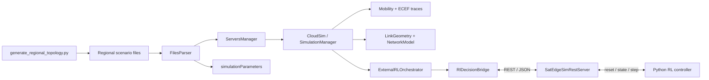
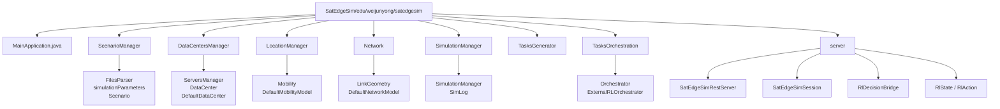

# SatEdgeSim：区域化 GEO–LEO–Ground 物理拓扑后端

SatEdgeSim 是一个基于 CloudSim Plus 的卫星边缘计算仿真器。本项目在保持原有 CloudSim 仿真生命周期和 REST/RL 接口兼容的基础上，提供了一个可复现、参数化的区域化 GEO–LEO–Ground 物理拓扑后端。

当前默认区域场景为：

```text
4 GEO + 28 LEO + 12 Ground gateway
```

本轮实现的范围是物理拓扑、确定性轨迹、基于几何的可见性判定、区域场景配置和验证工具；没有实现新的 DRL 算法、Configuration Viability、KEEP/RECONFIGURE、VoC 或 world model。

## 1. 快速开始

以下命令都应在项目根目录执行：

```text
satedgesimv2-github/
```

### Windows PowerShell

```powershell
cd "D:\research\experiment\6-DRL_satellite\satedgesimv2-github"

python scripts/generate_regional_topology.py `
  --geo-count 4 `
  --leo-count 28 `
  --leo-planes 4 `
  --ground-count 12 `
  --duration-sec 3600 `
  --step-sec 1 `
  --output-dir "SatEdgeSim/settings/scenarios/china_regional_4geo_28leo_12ground"

python scripts/validate_regional_topology.py `
  "SatEdgeSim/settings/scenarios/china_regional_4geo_28leo_12ground"

mvn '-DskipTests' 'compile'
```

启动区域化 REST server：

```powershell
mvn '-DskipTests' 'compile' 'exec:java' `
  '-Dexec.mainClass=edu.weijunyong.satedgesim.server.SatEdgeSimRestServer' `
  '-Dexec.args=--port 8088 --scenario-dir SatEdgeSim/settings/scenarios/china_regional_4geo_28leo_12ground'
```

PowerShell 中建议给 `-Dexec.mainClass` 和 `-Dexec.args` 加引号，避免 `=` 被命令解析器拆开。

### Linux / macOS Bash

```bash
cd /path/to/6-DRL_satellite/satedgesimv2-github

python3 scripts/generate_regional_topology.py \
  --geo-count 4 \
  --leo-count 28 \
  --leo-planes 4 \
  --ground-count 12 \
  --duration-sec 3600 \
  --step-sec 1 \
  --output-dir SatEdgeSim/settings/scenarios/china_regional_4geo_28leo_12ground

python3 scripts/validate_regional_topology.py \
  SatEdgeSim/settings/scenarios/china_regional_4geo_28leo_12ground

mvn -DskipTests compile
```

启动区域化 REST server：

```bash
mvn -DskipTests compile exec:java \
  -Dexec.mainClass=edu.weijunyong.satedgesim.server.SatEdgeSimRestServer \
  -Dexec.args="--port 8088 --scenario-dir SatEdgeSim/settings/scenarios/china_regional_4geo_28leo_12ground"
```

服务器启动后默认监听：

```text
http://127.0.0.1:8088
```

停止服务器时，在前台运行的终端按 `Ctrl+C` 即可。

## 2. 环境配置

### 必需环境

| 组件 | 推荐版本 | 用途 |
|---|---:|---|
| Git | 2.x | 获取代码和检查修改 |
| Java JDK | 8 或更高版本 | 编译和运行 Java/CloudSim 仿真 |
| Maven | 3.8+ | 编译、依赖解析和启动 REST server |
| Python | 3.8+ | 生成和验证区域拓扑 |

项目 Maven 编译目标为 Java 8：

```xml
<source>1.8</source>
<target>1.8</target>
```

建议在实验环境中固定一个 JDK 版本，并确认 `java`、`javac` 和 `mvn` 使用的是同一套 JDK。首次执行 Maven 时需要能够访问 Maven Central，以下载 CloudSim Plus、Gson、XChart 等依赖；依赖下载完成后，可以在离线环境中使用本地 Maven 缓存运行。

### Windows 环境

1. 安装 JDK，并配置 `JAVA_HOME`。
2. 将 `%JAVA_HOME%\bin` 加入 `PATH`。
3. 安装 Maven，并将 Maven 的 `bin` 目录加入 `PATH`；也可以使用 Maven Wrapper（如果后续加入）。
4. 安装 Python，并确保 `python` 命令可用。
5. 重新打开 PowerShell，检查：

```powershell
java -version
javac -version
mvn -version
python --version
git --version
```

一个典型的 PowerShell 配置示例：

```powershell
$env:JAVA_HOME = 'C:\Program Files\Java\jdk-17'
$env:Path = "$env:JAVA_HOME\bin;$env:Path"
```

若要永久配置，请使用 Windows“环境变量”设置，而不是只在当前 PowerShell 会话中设置。

### Linux 环境

以 Debian/Ubuntu 为例：

```bash
sudo apt update
sudo apt install -y git python3 python3-pip openjdk-17-jdk maven
```

检查：

```bash
java -version
javac -version
mvn -version
python3 --version
git --version
```

如系统安装了多个 JDK，可以选择默认版本：

```bash
sudo update-alternatives --config java
sudo update-alternatives --config javac
```

本项目的 Python 拓扑工具只使用 Python 标准库，不需要安装 `numpy`、`sgp4`、`skyfield` 或 GIS 库。

## 3. 生成区域拓扑

生成器：

```text
scripts/generate_regional_topology.py
```

默认参数：

| 参数 | 默认值 | 含义 |
|---|---:|---|
| `--geo-count` | `4` | GEO 节点数量 |
| `--leo-count` | `28` | LEO 节点数量 |
| `--leo-planes` | `4` | LEO 轨道面数量 |
| `--ground-count` | `12` | Ground gateway 数量 |
| `--duration-sec` | `3600` | 轨迹时间范围，包含终点 |
| `--step-sec` | `1` | 轨迹时间步长 |
| `--output-dir` | 区域场景目录 | 输出目录 |

约束：

```text
leo-count > 0
leo-planes > 0
leo-count % leo-planes == 0
duration-sec % step-sec == 0
```

例如：

```bash
python3 scripts/generate_regional_topology.py \
  --geo-count 4 \
  --leo-count 30 \
  --leo-planes 5 \
  --ground-count 12 \
  --duration-sec 1800 \
  --step-sec 1 \
  --output-dir SatEdgeSim/settings/scenarios/china_regional_4geo_30leo_12ground
```

`30 % 5 == 0`，因此该配置有效。若执行 `--leo-count 30 --leo-planes 4`，生成器会明确报错并返回非零退出码。

生成器会自动执行一次 validation，并输出场景名称、坐标系、节点数量、时间范围、轨道半径和输出文件。

## 4. 场景文件

默认区域场景位于：

```text
SatEdgeSim/settings/scenarios/china_regional_4geo_28leo_12ground/
├── simulation_parameters.properties
├── cloud.xml
├── edge_devices.xml
├── edge_datacenters.xml
├── scenario.json
└── locations/
    ├── geo.csv
    ├── leo.csv
    └── ground.csv
```

三类节点在 SatEdgeSim 旧语义中的映射保持不变：

| SatEdgeSim 类型 | 物理含义 |
|---|---|
| `EDGE_DEVICE` | LEO satellite |
| `CLOUD` | GEO satellite |
| `EDGE_DATACENTER` | Ground gateway / terrestrial edge datacenter |

### 坐标和轨迹

- 坐标系：ECEF
- CSV 单位：km
- Java 加载位置后转换为 m
- Earth radius：`6378.137 km`
- GEO altitude：`35786 km`
- LEO altitude：`550 km`
- LEO inclination：`53 deg`
- Ground：固定球形 ECEF 坐标
- GEO：固定 ECEF 坐标
- LEO：确定性 circular Walker-like 轨迹

CSV 使用 SatEdgeSim 兼容的 block 格式：每个节点一个 header 加多行坐标，节点 block 之间用空行分隔。block 顺序使用 1-based 节点 ID：

```text
block 1 -> ID 1
block 2 -> ID 2
...
```

`scenario.json` 只保存元数据和可复现实验参数，Java 核心仿真不依赖它。

### 仿真参数中的重要物理量

```properties
ground_min_elevation_deg=10
isl_min_clearance_m=100000

edge_devices_range=6000000
edge_datacenters_coverage=2500000
cloud_coverage=45000000
```

`min_height=400000` 仍是兼容旧配置的轨道高度相关参数，不再作为所有链路的统一 clearance 判据。

## 5. 拓扑验证

独立验证：

### Windows

```powershell
python scripts/validate_regional_topology.py `
  "SatEdgeSim/settings/scenarios/china_regional_4geo_28leo_12ground"
```

### Linux

```bash
python3 scripts/validate_regional_topology.py \
  SatEdgeSim/settings/scenarios/china_regional_4geo_28leo_12ground
```

验证项目包括：

- GEO/LEO/Ground block 数量
- 所有 CSV 的起始时间、终止时间和步长
- GEO、LEO、Ground 轨道半径
- GEO/Ground 坐标固定性
- LEO 坐标随时间变化
- Ground-satellite elevation sanity check
- Satellite-satellite Earth occultation sanity check
- Ground-ground 默认不可见
- 相同位置和同侧卫星链路 sanity check

Java 几何 smoke test：

```bash
java -cp "target/classes:<依赖类路径>" \
  edu.weijunyong.satedgesim.Network.LinkGeometrySmoke
```

通常直接执行 Maven 编译即可完成主要验证：

```bash
mvn -DskipTests compile
```

## 6. 启动 REST server

### 区域化场景

服务器启动时通过 `--scenario-dir` 自动映射：

```text
simulation_parameters.properties
cloud.xml
edge_devices.xml
edge_datacenters.xml
locations/geo.csv
locations/leo.csv
locations/ground.csv
```

如果场景目录中存在 `applications.xml`，优先使用该文件；否则继续使用默认的：

```text
SatEdgeSim/settings/applications.xml
```

Windows：

```powershell
mvn '-DskipTests' 'compile' 'exec:java' `
  '-Dexec.mainClass=edu.weijunyong.satedgesim.server.SatEdgeSimRestServer' `
  '-Dexec.args=--host 0.0.0.0 --port 8088 --scenario-dir SatEdgeSim/settings/scenarios/china_regional_4geo_28leo_12ground'
```

Linux：

```bash
mvn -DskipTests compile exec:java \
  -Dexec.mainClass=edu.weijunyong.satedgesim.server.SatEdgeSimRestServer \
  -Dexec.args="--host 0.0.0.0 --port 8088 --scenario-dir SatEdgeSim/settings/scenarios/china_regional_4geo_28leo_12ground"
```

兼容旧配置：

```text
--sim-config <path>
```

注意：`--sim-config` 只替换 properties 文件；要同时替换 XML 和 CSV 拓扑，使用 `--scenario-dir`。

### 服务器健康检查

Windows PowerShell：

```powershell
Invoke-RestMethod http://127.0.0.1:8088/health | ConvertTo-Json -Depth 5
```

Linux：

```bash
curl http://127.0.0.1:8088/health
```

## 7. REST/RL 使用方法

仿真不是由客户端手动推进每一秒。Java 仿真在 RL 决策点后台运行并等待，客户端读取 state 后提交动作，仿真继续运行到下一个决策点。

### 7.1 `/reset`

`POST /reset` 创建一个新 session。

区域场景的推荐请求：

```json
{
  "devicesCount": 28,
  "algorithmIndex": 0,
  "architectureIndex": 0,
  "seed": 42,
  "scenarioProfile": "default",
  "taskSourceMode": "current",
  "actionMaskMode": "visible_only",
  "simulationTimeMinutes": 30,
  "waitForFirstDecision": true,
  "waitTimeoutMs": 30000
}
```

Windows：

```powershell
$body = @'
{
  "devicesCount": 28,
  "algorithmIndex": 0,
  "architectureIndex": 0,
  "seed": 42,
  "scenarioProfile": "default",
  "taskSourceMode": "current",
  "actionMaskMode": "visible_only",
  "simulationTimeMinutes": 30,
  "waitForFirstDecision": true,
  "waitTimeoutMs": 30000
}
'@

$state = Invoke-RestMethod `
  -Method Post `
  -Uri http://127.0.0.1:8088/reset `
  -ContentType 'application/json' `
  -Body $body

$state | ConvertTo-Json -Depth 8
```

Linux：

```bash
curl -X POST http://127.0.0.1:8088/reset \
  -H 'Content-Type: application/json' \
  -d '{
    "devicesCount": 28,
    "algorithmIndex": 0,
    "architectureIndex": 0,
    "seed": 42,
    "scenarioProfile": "default",
    "taskSourceMode": "current",
    "actionMaskMode": "visible_only",
    "simulationTimeMinutes": 30,
    "waitForFirstDecision": true,
    "waitTimeoutMs": 30000
  }'
```

`devicesCount` 必须满足：

```text
1 <= devicesCount <= LEO trajectory block count
```

省略 `devicesCount` 时，默认使用当前场景的最大 LEO 数量，即默认区域场景中的 28。

`scenarioProfile` 必须使用 `default` 才会走本轮实际轨迹和几何可见性；不要使用 controlled profile 来伪造拓扑可用性。

### 7.2 `/get_state`

```bash
curl http://127.0.0.1:8088/get_state
```

重要字段：

| 字段 | 含义 |
|---|---|
| `status` | `WAITING_FOR_ACTION`、`RUNNING`、`FINISHED` 或 `FAILED` |
| `decisionId` | 当前决策编号 |
| `requestId` | 当前任务请求编号 |
| `taskId` | 当前任务编号 |
| `simulationTime` | 当前仿真时间 |
| `candidateVms` | 当前候选 VM 和节点信息 |
| `actionMask` | 原有具体 VM 动作 mask |
| `abstractActionMask` | 四动作抽象 mask |
| `datacenters` | GEO/LEO/Ground 节点及 ECEF 坐标 |
| `metrics` | 当前累计指标 |

候选 VM 的 `abstractAction` 保持以下语义：

```text
0 = local LEO
1 = neighbor LEO
2 = GEO
3 = ground gateway
```

每个 candidate 仍然对应一个具体 VM。控制器应先根据 `abstractAction` 或 `abstractActionMask` 选择抽象目标，再从 `candidateVms` 中选择一个可行的 `vmIndex` 或 `vmId`。

### 7.3 `/step`

最小动作请求：

```json
{
  "action": {
    "decisionId": 1,
    "taskId": 516,
    "targetVmIndex": 0,
    "cpuShare": 1.0,
    "bandwidthShare": 1.0,
    "txPowerRatio": 1.0,
    "queuePriority": 1.0
  },
  "waitTimeoutMs": 30000
}
```

Linux：

```bash
curl -X POST http://127.0.0.1:8088/step \
  -H 'Content-Type: application/json' \
  -d '{
    "action": {
      "decisionId": 1,
      "taskId": 516,
      "targetVmIndex": 0,
      "cpuShare": 1.0,
      "bandwidthShare": 1.0,
      "txPowerRatio": 1.0,
      "queuePriority": 1.0
    },
    "waitTimeoutMs": 30000
  }'
```

Windows PowerShell：

```powershell
$action = @{
  action = @{
    decisionId = 1
    taskId = 516
    targetVmIndex = 0
    cpuShare = 1.0
    bandwidthShare = 1.0
    txPowerRatio = 1.0
    queuePriority = 1.0
  }
  waitTimeoutMs = 30000
} | ConvertTo-Json -Depth 5

Invoke-RestMethod `
  -Method Post `
  -Uri http://127.0.0.1:8088/step `
  -ContentType 'application/json' `
  -Body $action | ConvertTo-Json -Depth 8
```

推荐直接使用 `/get_state` 返回的当前 `decisionId`、`taskId` 和候选 VM 的 `vmIndex`，不要硬编码示例中的数字。

### 7.4 其他接口

| 接口 | 方法 | 用途 |
|---|---|---|
| `/health` | GET | 服务和 session 健康状态 |
| `/reset` | POST | 创建或替换仿真 session |
| `/get_state` | GET | 获取当前 RL state |
| `/step` | POST | 提交动作并等待下一决策点 |
| `/apply_action` | POST | 提交动作并获取执行回执 |
| `/get_metrics` | GET | 获取当前累计指标 |
| `/close` | POST | 关闭当前 session |
| `/debug/current_decision` | GET | 调试当前决策 |
| `/debug/last_receipt` | GET | 调试最近一次动作回执 |
| `/debug/receipt_stats` | GET | 调试动作回执统计 |

关闭 session：

```bash
curl -X POST http://127.0.0.1:8088/close
```

## 8. Python 客户端

仓库提供了最小 REST 客户端：

```text
examples/python_client/rl_rest_client.py
```

安装依赖：

```bash
python3 -m venv .venv
source .venv/bin/activate
python -m pip install --upgrade pip requests
```

Windows PowerShell：

```powershell
python -m venv .venv
.\.venv\Scripts\Activate.ps1
python -m pip install --upgrade pip requests
```

Linux：

```bash
python3 -m venv .venv
source .venv/bin/activate
python -m pip install --upgrade pip requests
```

启动 REST server 后运行：

```bash
python examples/python_client/rl_rest_client.py \
  --base-url http://127.0.0.1:8088 \
  --devices 28
```

该客户端只是 smoke client：它会选择第一个可行 VM 并持续提交动作，不代表论文中的最终 DRL 控制器。

## 9. 代码结构

### 总体数据流



### Java 包结构



### 目录树

```text
.
├── README.md
├── RL_SERVER_README.md
├── pom.xml
├── scripts/
│   ├── generate_regional_topology.py
│   ├── validate_regional_topology.py
│   ├── generate_edge_devices_location.py
│   └── run_rl_server.sh
├── examples/
│   └── python_client/
│       └── rl_rest_client.py
├── SatEdgeSim/
│   ├── edu/weijunyong/satedgesim/
│   │   ├── DataCentersManager/
│   │   ├── LocationManager/
│   │   ├── Network/
│   │   │   ├── LinkGeometry.java
│   │   │   └── LinkGeometrySmoke.java
│   │   ├── ScenarioManager/
│   │   ├── SimulationManager/
│   │   ├── TasksGenerator/
│   │   ├── TasksOrchestration/
│   │   ├── server/
│   │   └── MainApplication.java
│   └── settings/
│       ├── applications.xml
│       ├── cloud.xml
│       ├── edge_datacenters.xml
│       ├── edge_devices.xml
│       ├── simulation_parameters.properties
│       └── scenarios/
│           └── china_regional_4geo_28leo_12ground/
│               ├── cloud.xml
│               ├── edge_datacenters.xml
│               ├── edge_devices.xml
│               ├── scenario.json
│               ├── simulation_parameters.properties
│               └── locations/
│                   ├── geo.csv
│                   ├── ground.csv
│                   └── leo.csv
└── target/
```

## 10. 物理链路判定

`LinkGeometry` 是纯几何判定类，实际通信可用性由两层条件共同决定：

```text
geometry visibility AND distance/range
```

### Ground–Satellite

```text
elevation >= ground_min_elevation_deg
```

默认 minimum elevation 为 10°。

### Satellite–Satellite

LEO–LEO、LEO–GEO 和 GEO–GEO 使用地心到线段的最小距离判断 Earth occultation：

```text
minimum segment radius > Earth radius + isl_min_clearance_m
```

默认 ISL clearance 为 100 km。

### Ground–Ground

不同 Ground gateway 默认没有直接 terrestrial backbone 链路；相同节点仍然可视为本地可达。

## 11. 默认场景验收结果

在当前仓库中已验证：

```text
GEO = 4
LEO = 28
Ground = 12
Total = 44
```

REST `/get_state` 中的半径约为：

```text
LEO    = 6,928,137 m
GEO    = 42,164,137 m
Ground = 6,378,137 m
```

`scenarioProfile=default` 时使用真实 ECEF 轨迹和几何可见性。LEO 邻居、GEO 和 Ground 链路不保证在每个时刻都可见，这是动态卫星拓扑的预期行为。

## 12. 故障排查

### `/reset` 返回 `settings files failed validation`

确认：

1. `--scenario-dir` 指向场景目录，而不是 `scenario.json`。
2. 场景目录包含 `cloud.xml`、`edge_devices.xml`、`edge_datacenters.xml`。
3. `locations/` 下包含 `geo.csv`、`leo.csv`、`ground.csv`。
4. 重新运行生成器和 validator。

### `devicesCount` 报错

`devicesCount` 不能大于 `leo.csv` 的 block 数量。例如默认场景最多为 28：

```text
devicesCount=29 -> HTTP 400
```

### Maven 依赖下载失败

确认网络、代理和 Maven 镜像配置；然后重新执行：

```bash
mvn -U -DskipTests compile
```

### 端口被占用

Windows：

```powershell
Get-NetTCPConnection -LocalPort 8088
```

Linux：

```bash
ss -ltnp | grep 8088
```

也可以换端口：

```text
--port 8090
```

### Java 进程仍在等待动作

这是正常的 RL server 行为：仿真线程正在等待 `/step`。先调用：

```text
GET /get_state
```

选择一个 `candidateVms[].feasible=true` 的候选 VM，再调用 `/step`。

## 13. 当前限制和后续方向

- `estimatedLinkLifetimeSec` 仍是现有 heuristic，本轮没有重写。
- 尚未接入真实 TLE/SGP4 数据。
- 尚未实现 RF link budget、天气衰减或地面 backbone。
- `scenario.json` 当前是 metadata，不是 Java 仿真的强依赖配置。
- 旧默认 settings 仍保留，区域场景通过独立目录加载。

下一阶段可以在不改变本 README 所述 REST/RL 接口的前提下，将确定性轨迹扩展为：

```text
trajectory
    -> future contact window
    -> deterministic contact lifetime
    -> configuration viability
```

